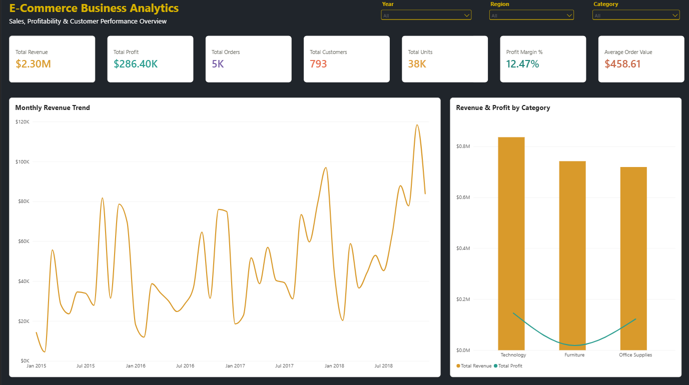
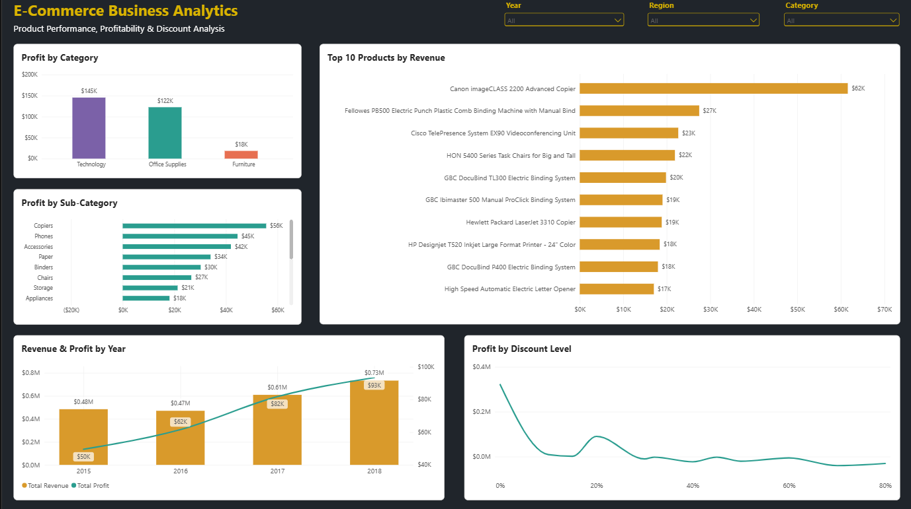
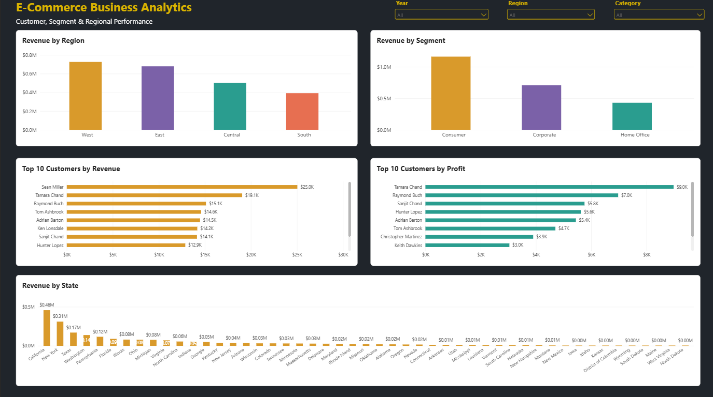

# E-Commerce Business Analytics

An end-to-end data analytics project focused on analyzing e-commerce sales, profitability, customer behavior, product performance, regional trends, and discount impact using the Sample Superstore dataset.

The project follows a complete analytics workflow from data cleaning and SQL analysis to Python-based exploratory analysis and an interactive Power BI dashboard.


## Project Overview

This project analyzes e-commerce sales data to understand business performance and identify factors affecting revenue and profitability.

The analysis focuses on:

- Overall sales and profit performance
- Category and sub-category profitability
- Regional sales and profit trends
- Customer revenue and profitability
- Year-over-year business growth
- Discount levels and their relationship with profitability
- Product performance and business opportunities

The goal is to transform raw transactional data into meaningful business insights and an interactive dashboard that can support data-driven decision-making.


## Business Questions

This analysis aims to answer the following business questions:

1. How is the overall business performing in terms of revenue and profit?
2. Which product categories and sub-categories generate the most revenue and profit?
3. Which products or sub-categories are contributing to losses?
4. How does profitability vary across different regions?
5. How has revenue and profit changed over time?
6. How do different discount levels relate to profitability?
7. Which customers generate the highest revenue and profit?
8. Does high sales revenue always translate into high profitability?
9. Which areas of the business demonstrate strong profitability?
10. Where are the key opportunities for improving business performance?


## Dataset & Data Preparation

### Dataset

The project uses the **Sample Superstore** dataset, containing transactional e-commerce sales data across customers, products, categories, regions, orders, sales, discounts, and profit.

The cleaned dataset contains:

- **9,994 records**
- **21 columns**
- **0 duplicate records**
- **11 missing Postal Code values**

### Data Preparation

The dataset was cleaned and prepared before analysis:

- Removed duplicate records
- Reviewed missing values
- Standardized column names and data types
- Converted date fields into proper date formats
- Converted Sales, Discount, and Profit into appropriate numeric data types
- Validated the cleaned dataset before loading it into MySQL and Power BI

The original raw dataset was preserved separately to maintain data lineage and allow the cleaning process to be reproduced.


## Tools & Technologies

| Tool / Technology | Purpose |
|---|---|
| Excel | Initial data cleaning and validation |
| MySQL | Data storage and SQL-based business analysis |
| Python | Data cleaning, exploratory data analysis, and business analysis |
| Pandas | Data manipulation and transformation |
| Matplotlib | Data visualization during exploratory analysis |
| Power BI | Interactive dashboard and business reporting |
| DAX | Measures and KPI calculations |
| GitHub | Version control and project documentation |
| GitHub Desktop | Repository and Git workflow management |


## Project Workflow

The project follows an end-to-end analytics workflow:

1. **Excel** → Initial data cleaning and validation
2. **MySQL** → Data storage and SQL-based business analysis
3. **Python** → Data cleaning, exploratory data analysis, and business analysis
4. **Power BI** → Interactive dashboard development and visualization
5. **Business Insights** → Interpretation of analytical findings
6. **Documentation** → Project report, README, and portfolio presentation

This workflow demonstrates the complete process of transforming raw transactional data into actionable business insights.


## SQL Business Analysis

MySQL was used to store the cleaned dataset and perform business-focused analysis using SQL queries.

The analysis included:

- Overall business KPIs
- Revenue and profit analysis
- Category and sub-category performance
- Regional analysis
- Customer analysis
- Product analysis
- Discount impact analysis
- Year-over-year performance
- Ship mode analysis
- State-level analysis

A total of **16 SQL business queries** were developed to answer key business questions and generate analytical insights.

### Key SQL Metrics

| Metric | Value |
|---|---:|
| Total Revenue | $2,297,201.07 |
| Total Profit | $286,397.79 |
| Profit Margin | 12.47% |
| Total Orders | 5,009 |
| Total Customers | 793 |
| Total Units Sold | 37,873 |
| Average Order Value | $458.61 |


## Python Analysis

Python was used to perform data cleaning, exploratory data analysis (EDA), and business-focused analysis after the SQL stage.

### Data Cleaning

The cleaned dataset was validated using Pandas by checking:

- Dataset dimensions
- Data types
- Missing values
- Duplicate records
- Numerical summaries
- Date fields
- Sales, Discount, and Profit values

### Exploratory Data Analysis

The EDA focused on understanding:

- Revenue and profit distribution
- Category and sub-category performance
- Regional performance
- Yearly trends
- Discount and profitability patterns
- Customer performance
- Product performance

### Business Analysis

Python was also used to calculate and investigate key business metrics and patterns that were later incorporated into the Power BI dashboard and final business insights.


## Power BI Dashboard

Power BI was used to transform the analytical results into an interactive three-page business dashboard.

### Dashboard Pages

#### 1. Executive Overview
Provides a high-level view of business performance through:

- Revenue
- Profit
- Orders
- Customers
- Units Sold
- Profit Margin
- Average Order Value
- Monthly Revenue Trend
- Revenue and Profit by Category

#### 2. Product & Profitability
Focuses on product and profitability analysis through:

- Profit by Category
- Top 10 Products by Revenue
- Profit by Sub-Category
- Revenue and Profit by Year
- Profit by Discount Level

#### 3. Customer & Regional Analysis
Focuses on customer and geographic performance through:

- Revenue by Region
- Revenue by Segment
- Top 10 Customers by Revenue
- Top 10 Customers by Profit
- Revenue by State

### Interactive Filters

The dashboard includes synchronized filters for:

- Year
- Region
- Category

These filters allow users to explore the analysis dynamically across all three dashboard pages.


## Key Business Insights

The analysis identified several important business findings:

1. **Overall Performance**  
   The business generated $2.30M in revenue and $286.40K in profit, resulting in a 12.47% overall profit margin.

2. **Category Profitability**  
   Technology and Office Supplies generated profit margins of 17.40% and 17.04%, respectively, both above the overall business margin.

3. **Furniture Profitability**  
   Furniture generated $742.00K in revenue but achieved only a 2.49% profit margin, significantly below the overall margin.

4. **Loss-Making Sub-Category**  
   Tables generated a loss of $17.73K with a -8.56% profit margin, making it a major contributor to Furniture's weak profitability.

5. **Strong Sub-Category Performance**  
   Copiers generated $55.62K in profit at a 37.20% margin, while Paper generated $34.05K at a 43.39% margin.

6. **Discount and Profitability**  
   Aggregated profit was negative at the 30% discount level, with several higher discount levels also showing losses.

7. **Regional Profitability**  
   Profit margins varied across regions, from 7.92% in Central to 14.94% in West.

8. **Business Growth**  
   Revenue increased from $484.25K in 2015 to $733.22K in 2018, while profit increased from $49.54K to $93.44K.

9. **Revenue vs. Profitability**  
   Customer revenue rankings and profit rankings do not perfectly align, demonstrating that sales volume alone does not fully represent customer value.

10. **Revenue and Profit Relationship**  
    The 2016 results demonstrate that revenue and profit do not always move together: revenue was slightly lower than 2015, while profit increased.


## Business Implications & Recommendations

Based on the analysis, the following areas could be considered for improving business performance:

- Review pricing, costs, and discount strategies for loss-making sub-categories, particularly Tables.
- Evaluate higher discount levels carefully, as discounts of 30% and above were associated with negative profitability in the analyzed data.
- Investigate why Furniture generates substantial revenue but a relatively low profit margin.
- Examine the factors contributing to the lower profitability observed in the Central region.
- Identify practices from high-margin sub-categories such as Copiers and Paper that may provide useful benchmarks for other product areas.
- Evaluate customers using both revenue and profitability metrics rather than relying on sales volume alone.
- Continue monitoring revenue and profit trends to understand whether business growth is accompanied by sustainable profitability.


## Project Structure

```text
E-Commerce-Business-Analytics/
│
├── data/
│   ├── cleaned/
│   │   ├── ecommerce_cleaned_mysql.csv
│   │   └── ecommerce_cleaned.xlsx
│   │
│   └── raw/
│       └── ecommerce_raw.csv
│
├── excel/
│   └── ecommerce_data_cleaning.xlsx
│
├── powerbi/
│   └── E-Commerce-Business-Analytics.pbix
│
├── python/
│   ├── 01_data_cleaning.ipynb
│   ├── 02_eda.ipynb
│   └── 03_business_analysis.ipynb
│
├── sql/
│   ├── 03_insert_data.py
│   └── 04_business_analysis.sql
│
└── README.md
```


## Dashboard Preview

The Power BI dashboard provides an interactive view of e-commerce business performance across three analytical pages.

### Executive Overview



Provides a high-level view of sales, profitability, customers, and overall business performance.

### Product & Profitability



Provides insights into product, category, sub-category, yearly, and discount-level profitability.

### Customer & Regional Analysis



Provides insights into customer performance, segments, regions, and state-level revenue.

The dashboard includes synchronized **Year, Region, and Category** filters for interactive exploration across all three pages.


## Conclusion

This project demonstrates an end-to-end approach to e-commerce business analytics, starting from raw transactional data and progressing through data cleaning, SQL analysis, Python-based exploration, and interactive Power BI visualization.

The analysis highlights differences in category, product, regional, customer, and discount-level performance and converts those findings into business-focused insights.

The final dashboard provides an interactive way to explore these patterns and evaluate business performance from multiple perspectives.